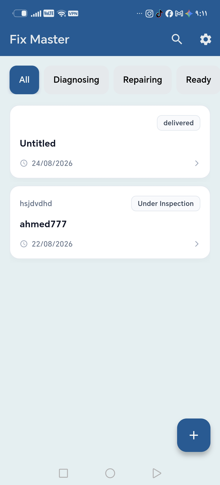
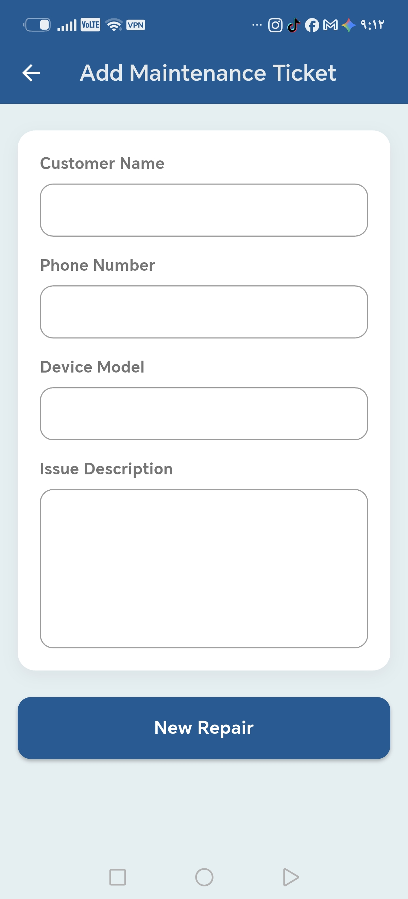
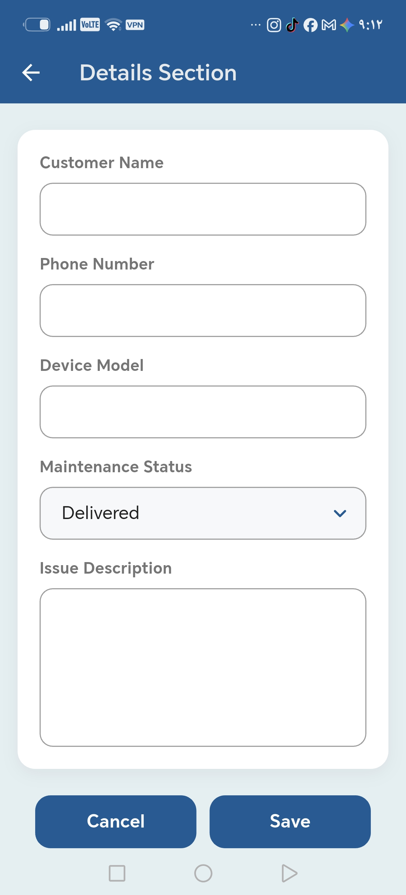

# 🛠️ Fix Master

**Fix Master** is a clean, modern mobile application built with Flutter to help repair shops (phones, electronics, and devices) manage their maintenance workflow from intake to delivery — all in one place.

It replaces paper tickets and scattered notes with a structured, searchable, and fully trackable digital repair log, complete with automatic **WhatsApp** notifications to customers the moment their device is ready for pickup.

---

## ✨ Features

- **📋 Ticket Management (CRUD)** — Create, view, update, and delete maintenance tickets with customer name, phone number, device model, and issue description.
- **🔄 Status Tracking** — Move each repair through its lifecycle: `Under Inspection → Under Repair → Ready for Delivery → Delivered`.
- **🗂️ Category Filtering** — Quickly filter the ticket list by status using a horizontal scrollable category bar.
- **💬 Automated WhatsApp Notifications** — When a ticket is marked as _Delivered_, Fix Master automatically opens WhatsApp with a pre-filled, friendly message to the customer.
- **👉 Swipe to Delete** — Intuitive swipe gesture with animated feedback to remove tickets.
- **🔃 Pull to Refresh** — Refresh the ticket list with a simple pull-down gesture.
- **🎬 Animated Splash Screen** — Branded startup experience with fade/slide transitions and a startup sound effect.
- **🎨 Clean, Custom UI Kit** — Reusable, polished components (input fields, dropdowns, cards, buttons) built for consistency across the app.

---

## 🏗️ Architecture

Fix Master is built following **Clean Architecture** principles combined with the **BLoC (Cubit)** pattern for predictable, testable state management.

```
lib/
└── features/
    └── repairs/
        ├── data/            # Data sources & repository implementations
        ├── domain/
        │   ├── entities/    # Core business models (MaintenanceTicket)
        │   ├── enums/       # TicketStatus and other domain enums
        │   └── usecases/    # GetAllTickets, CreateTicket, UpdateTicket, DeleteTicket...
        └── presentation/
            ├── cubit/       # MaintenanceTicketCubit + State (BLoC state management)
            ├── pages/       # HomePage, AddMaintenanceTicket, TicketDetailsSection, SplashPage
            └── widgets/     # Reusable UI components
```

**Key design decisions:**

- **Separation of concerns** — UI, business logic, and data access are fully decoupled.
- **Use-case driven** — Every action (create, update, delete, fetch) is encapsulated in a single-responsibility use case.
- **Functional error handling** — Repository results are wrapped and handled via `.fold()` for explicit success/failure paths.
- **Dependency Injection** — A service locator (`sl`) provides cubits and use cases wherever needed.

---

## 🧰 Tech Stack

| Category         | Package / Tool                                                               |
| ---------------- | ---------------------------------------------------------------------------- |
| Framework        | [Flutter](https://flutter.dev)                                               |
| State Management | [flutter_bloc](https://pub.dev/packages/flutter_bloc) (Cubit)                |
| Value Equality   | [equatable](https://pub.dev/packages/equatable)                              |
| External Actions | [url_launcher](https://pub.dev/packages/url_launcher) (WhatsApp integration) |
| Date Formatting  | [intl](https://pub.dev/packages/intl)                                        |
| Architecture     | Clean Architecture (Data / Domain / Presentation)                            |

---

## 📱 Screens

| Screen                     | Description                                                                                       |
| -------------------------- | ------------------------------------------------------------------------------------------------- |
| **Splash Screen**          | Animated intro with the Fix Master branding.                                                      |
| **Home Page**              | List of all repair tickets with category filters and a floating action button to add new tickets. |
| **Add Maintenance Ticket** | Form to register a new repair with customer and device details.                                   |
| **Ticket Details**         | View and edit a ticket, update its status, and trigger delivery notifications.                    |

---

## 🖼️ Screenshots

<p align="center">
  
  &nbsp;&nbsp;
  
  &nbsp;&nbsp;
  
  &nbsp;&nbsp;
  
</p>

<p align="center">
  <sub><b>Splash Screen</b> &nbsp;&nbsp;&nbsp;&nbsp;&nbsp;&nbsp; <b>Home Page</b> &nbsp;&nbsp;&nbsp;&nbsp;&nbsp;&nbsp; <b>Add Maintenance Ticket</b> &nbsp;&nbsp;&nbsp;&nbsp;&nbsp;&nbsp; <b>Ticket Details</b></sub>
</p>

> 📌 Add your four screenshots to `assets/screenshots/` as `screenshot_1.jpg` (Splash Screen), `screenshot_2.jpg` (Home Page), `screenshot_3.jpg` (Add Maintenance Ticket), and `screenshot_4.jpg` (Ticket Details) — or update the paths above to match your file names.

---

## 🚀 Getting Started

### Prerequisites

- [Flutter SDK](https://docs.flutter.dev/get-started/install) (latest stable channel)
- Dart SDK (bundled with Flutter)
- Android Studio / VS Code with the Flutter & Dart plugins
- A connected device or emulator

### Installation

```bash
# 1. Clone the repository
git clone https://github.com/<your-username>/fix_master.git
cd fix_master

# 2. Install dependencies
flutter pub get

# 3. Run the app
flutter run
```

### Build a Release APK

```bash
flutter build apk --release
```

---

## 📂 Project Structure Highlights

- `maintenance_ticket_cubit.dart` — Core state management: fetching, filtering, creating, updating, and deleting tickets, plus WhatsApp message dispatch.
- `maintenance_ticket_state.dart` — Sealed state classes (`Initial`, `Loading`, `Loaded`, `Error`) for predictable UI rendering.
- `repairs_list_view.dart` — Displays the ticket list with swipe-to-delete and pull-to-refresh support.
- `ticket_details_section.dart` — Edit form bound to an existing ticket, including status change.
- `add_maintenance_ticket.dart` — Form to submit a brand-new repair ticket.

---

## 🗺️ Roadmap

- [ ] Search functionality within tickets
- [ ] Local/cloud data persistence layer
- [ ] Ticket history & analytics dashboard
- [ ] Multi-language support (Arabic / English)
- [ ] Push notifications alongside WhatsApp messaging

---

## 🤝 Contributing

Contributions, issues, and feature requests are welcome!
Feel free to check the [issues page](../../issues) or open a pull request.

1. Fork the project
2. Create your feature branch (`git checkout -b feature/amazing-feature`)
3. Commit your changes (`git commit -m 'Add some amazing feature'`)
4. Push to the branch (`git push origin feature/amazing-feature`)
5. Open a Pull Request

---

## 📄 License

This project is licensed under the MIT License — feel free to use, modify, and distribute it.

---

## 👤 Author

Built with ❤️ for repair shops that deserve better tools than pen and paper.
